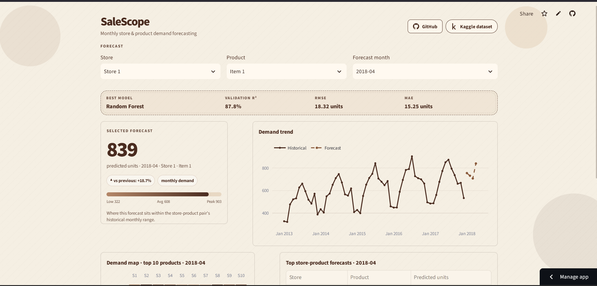
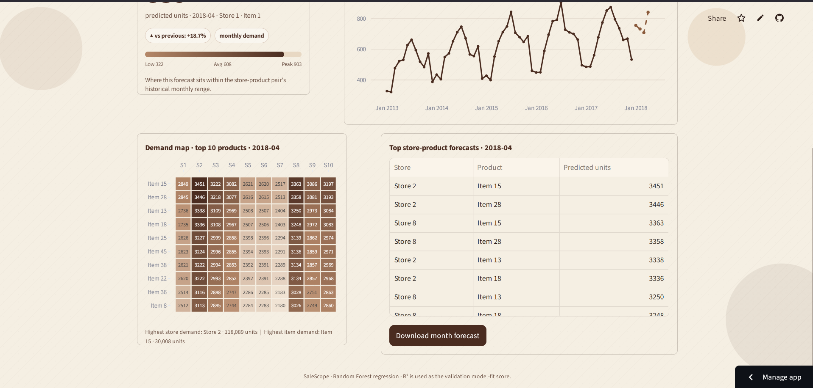

<div align="center">

# SaleScope

**Monthly store & product demand forecasting, in one page.**

[](https://mysalescope.streamlit.app)
[](https://www.kaggle.com/competitions/demand-forecasting-kernels-only/data)


</div>

<br>





## What it does

Pick a **store**, a **product** and a **month**, and SaleScope predicts the total units that pair will sell that month.

- **Forecast card** with an animated count-up, change vs. the previous month, and a gauge showing where the forecast sits in that pair's historical low-to-peak range.
- **Demand trend** from Jan 2013 up to the month you selected: history as a solid line, forecast as a dashed line.
- **Demand map** heatmap of the top 10 products across all 10 stores for the selected month.
- **Top forecasts** table plus a CSV download of the whole month.
- Forecast any month from **2018-01 to 2027-12**.

> The training data ends in March 2018 and a Random Forest cannot extrapolate trends. Months far past 2018 repeat the seasonal pattern rather than growing, so treat them as rough estimates.

## Model

| | |
|---|---|
| Model | Random Forest regressor (scikit-learn pipeline) |
| Target | Monthly units sold per store-item pair |
| Features | `year`, `month`, `quarter`, `time_index`, `store`, `item` |
| Validation R² | 0.878 |
| RMSE / MAE | 18.32 / 15.25 units |

Training happens in [`notebook/`](notebook); the app only loads the saved pipeline.

## Tech stack

| | Tool | Used for |
|---|---|---|
|  | Python | Everything |
|  | scikit-learn 1.6.1 | Model and preprocessing pipeline |
|  | pandas | Data prep and aggregation |
|  | NumPy | Numerics |
|  | Plotly | Trend chart and heatmap |
|  | Jupyter | Training and evaluation notebook |
|  | Streamlit | Web app and hosting |

## Project structure

```text
SaleScope/
├── app.py                 # Streamlit app
├── requirements.txt
├── favicon.png
├── .streamlit/config.toml # light theme
├── data/
│   ├── monthly.csv        # train.csv pre-aggregated by month (used by the app)
│   ├── train.csv          # raw Kaggle data (only needed for retraining)
│   └── test.csv
├── models/
│   └── best_model.joblib
├── notebook/              # training notebook
└── repo_assets/           # README screenshots
```

## Run locally

```bash
git clone https://github.com/varadisthedev/SaleScope.git
cd SaleScope
pip install -r requirements.txt
streamlit run app.py
```

## Deploying on Streamlit Cloud

The model was pickled with **scikit-learn 1.6.1**, which has no wheel for Python 3.14. In **Advanced settings**, choose **Python 3.12** or the build will be very slow or fail. If you retrain with a newer scikit-learn, update the pin in `requirements.txt` to match.

## Data

[Store Item Demand Forecasting](https://www.kaggle.com/competitions/demand-forecasting-kernels-only/data): 5 years of daily sales for 50 items across 10 stores, aggregated to monthly totals.
